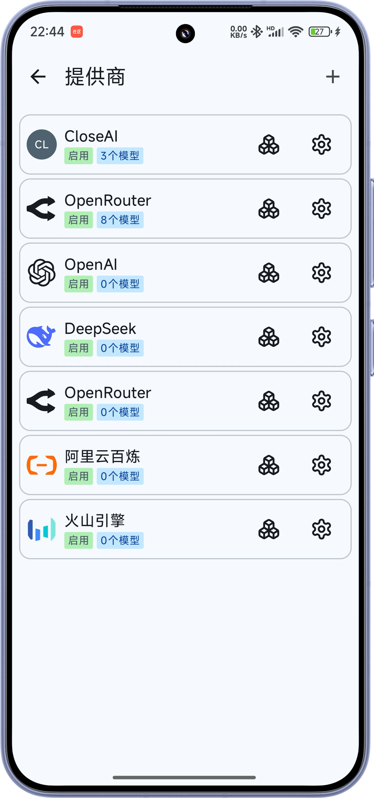
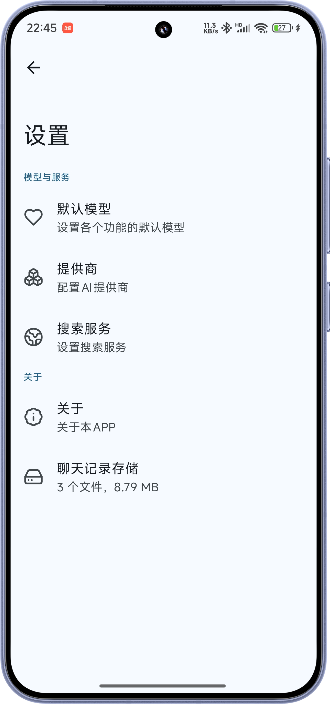

# RikkaHub

点击链接加入群聊[【RikkaHub】](https://qm.qq.com/q/I8MSU0FkOu)

一个原生开发安卓LLM聊天客户端，支持切换不同的供应商进行聊天

  
  
  

## 功能

- [x] 现代化安卓APP设计 (Material You / 预测性返回)
- [x] 暗色模式
- [x] 多种类型的供应商支持，自定义API/URL/模型 (目前支持OpenAI, Google)
- [x] 多模态输入
- [x] Markdown渲染 (代码高亮，数学公式..)
- [ ] 多语言支持
- [ ] 搜索支持

## 下载

https://github.com/re-ovo/rikkahub/releases

## 许可证

[Apache License 2.0](LICENSE)