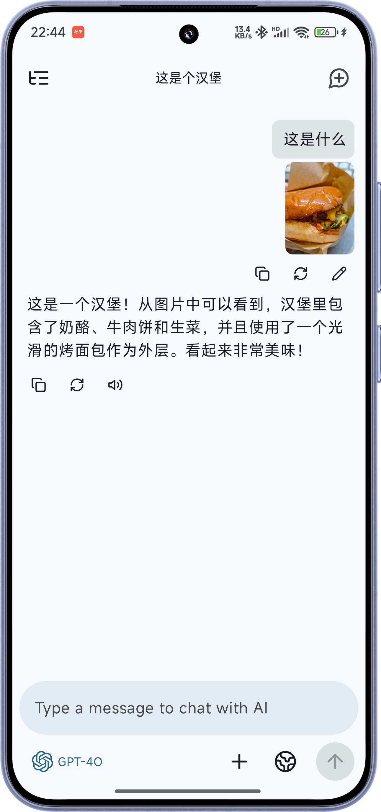

  
  <h1>RikkaHub</h1>

> 点击链接加入群聊 👉 [【RikkaHub】](https://qm.qq.com/q/I8MSU0FkOu)

一个原生Android LLM 聊天客户端，支持切换不同的供应商进行聊天 🤖💬

  
  
  
  

## 🚀 下载

🔗 [点击前往下载页面](https://github.com/re-ovo/rikkahub/releases)

## ✨ 功能特色

- 🎨 现代化安卓APP设计（Material You / 预测性返回）
- 🌙 暗色模式
- 🔄 多种类型的供应商支持，自定义 API / URL / 模型（目前支持 OpenAI、Google）
- 🖼️ 多模态输入支持
- 📝 Markdown 渲染（支持代码高亮、数学公式、表格等）
- 🔍 搜索支持（Exa、Tavily）
- 🧩 Prompt 变量（模型名称、时间等）

## 开发计划

- 🌐 完善多语言支持
- 🔍 支持调整更多模型参数 (例如思考budget)
- 🔊 完善TTS功能
- 📝 内置翻译页面
- 🤳 二维码导出和导入提供商

## 📄 许可证

[Apache License 2.0](LICENSE)
