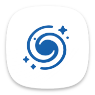

  
  <h1>RikkaHub</h1>

A native Android LLM chat client that supports switching between different providers for conversations 🤖💬

Click to join our Discord server 👉 [【RikkaHub】](https://discord.gg/9weBqxe5c4)

[简体中文](README_ZH_CN.md) | [繁體中文](README_ZH_TW.md) | English

  
  
  
  

## 🚀 Download

🔗 [Visit the official website to download](https://rikka-ai.com/)

## ✨ Features

- 🎨 Modern Android app design (Material You / Predictive Back)
- 🌙 Dark mode
- 🔄 Support for multiple provider types, custom API / URL / models (currently supports OpenAI, Google)
- 🖼️ Multimodal input support
- 📝 Markdown rendering (supports code highlighting, math formulas, tables, Mermaid)
- 🔍 Search capabilities (Exa, Tavily, Zhipu)
- 🧩 Prompt variables (model name, time, etc.)
- 🤳 QR code export and import for providers
- 🤖 Agent customization
- 🧠 ChatGPT-like memory feature
- 📝 AI Translation
- 🌐 Custom HTTP request headers and request bodies

## ✨ Contributing

This project is developed using [Android Studio](https://developer.android.com/studio). PRs are welcome!

Technology stack documentation:

- [Kotlin](https://kotlinlang.org/) (Development language)
- [Koin](https://insert-koin.io/) (Dependency Injection)
- [Jetpack Compose](https://developer.android.com/jetpack/compose) (UI framework)
- [DataStore](https://developer.android.com/topic/libraries/architecture/datastore) (Preference data storage)
- [Room](https://developer.android.com/training/data-storage/room) (Database)
- [Coil](https://coil-kt.github.io/coil/) (Image loading)
- [Material You](https://m3.material.io/) (UI design)
- [Navigation Compose](https://developer.android.com/develop/ui/compose/navigation) (Navigation)
- [Okhttp](https://square.github.io/okhttp/) (HTTP client)
- [kotlinx.serialization](https://github.com/Kotlin/kotlinx.serialization) (JSON serialization)
- [compose-icons/lucide](https://composeicons.com/icon-libraries/lucide) (Icon library)

> You need a `google-services.json` file at `app` folder to build the app.

## 💰 Donate

## ⭐ Star History

If you like this project, please give it a star ⭐

## 📄 License

[License](LICENSE)
